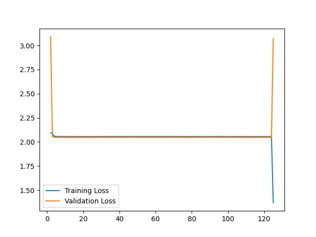

# Neural Network to classify images by semantic tags
Data taken from Firejet take home interview question

## Context
The work shown in this repository is meant as my solution to the Firejet take home interview question. The model is a simple model that at its best has about 1.12 validation loss when training. After training when used to classify the entire initial data folder, there is about 0.6 loss with 78% accuracy.

### Considerations
Firstly, I noticed the data was not the cleanest. Some images are either misrepresented by the label or do not have a fitting label within the csv file. Regardless, I assumed the data was not to be touched manually so my processing was done via code.

I deliberately chose to run through the images in the program and remove images where the semantic tag has highlighted a region with uniform information. These images likely serve little information to the training and their removal would improve my training performance.

Secondly, I noted that label "textarea" has only 12 data points. This is unlikely to be sufficient for the model to consistently mark it accurately, so I added a toggle. Disregarding "textarea" lowers the validation loss in training by about 0.1, which is not insignificant. However, for my final model I have included such data as I assume would be desired by the interview question

Lastly, I chose to save the model with the lowest validation loss during training as it likely has the best ability to generalise to a larger dataset. I am certain if desired, I can get the model to accurately identify 90% of the data given by disregarding the ability to generalise.

## Using the program
Hopefully, my comments have allow sufficient understanding of the code.

I would recommend to begin by modifying the following variables found before the main function: LABELINFO,IMGPATH. They are the variables indicating the data source, and the program would not function if done incorrect.

## Warning
There appears to be a bug(?) where when training the neural network, the accuracy is consistently ~0.2 and does not improve despite more training. This can occur even halfway through a run where accuracy can be 0.6 and it may still fall into the 0.2 range and stop improving. I believe there to be a mathematical reason behind this but as I am unable to consistently replicate this, I am unable to investigate further. 
An example is given in this graph, note the large deflections at the beginning and the end were due to wonky averaging.

## Others
count-types.py just counts the number of images which are classified under each label within the csv file, nothing major.
other.py just prints to terminal the structure of the model saved under folder "best", it was useful for me